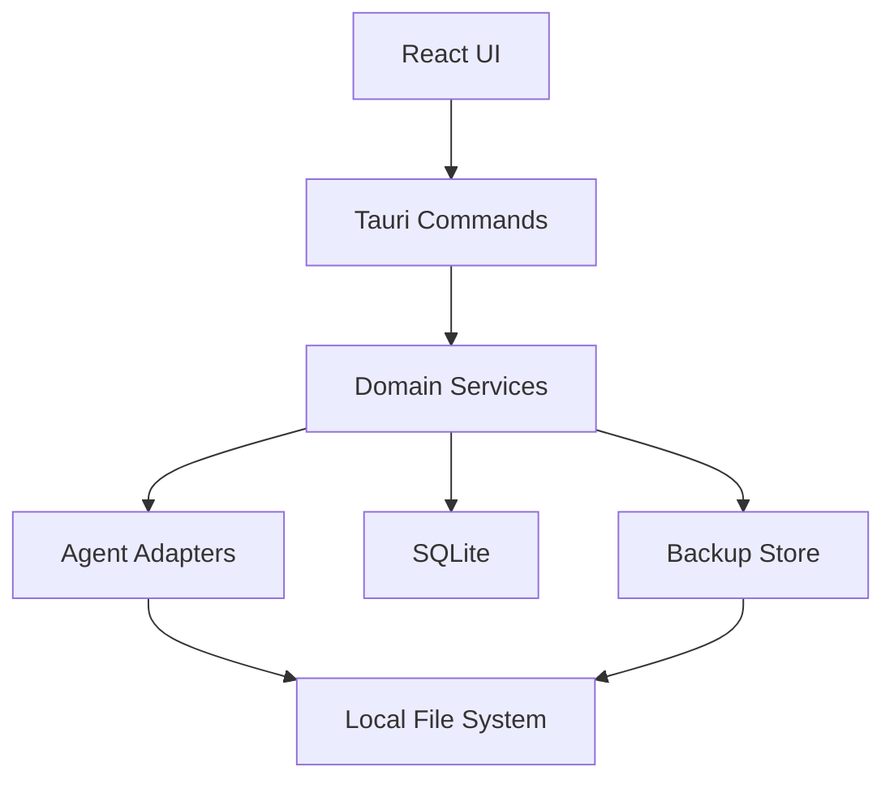
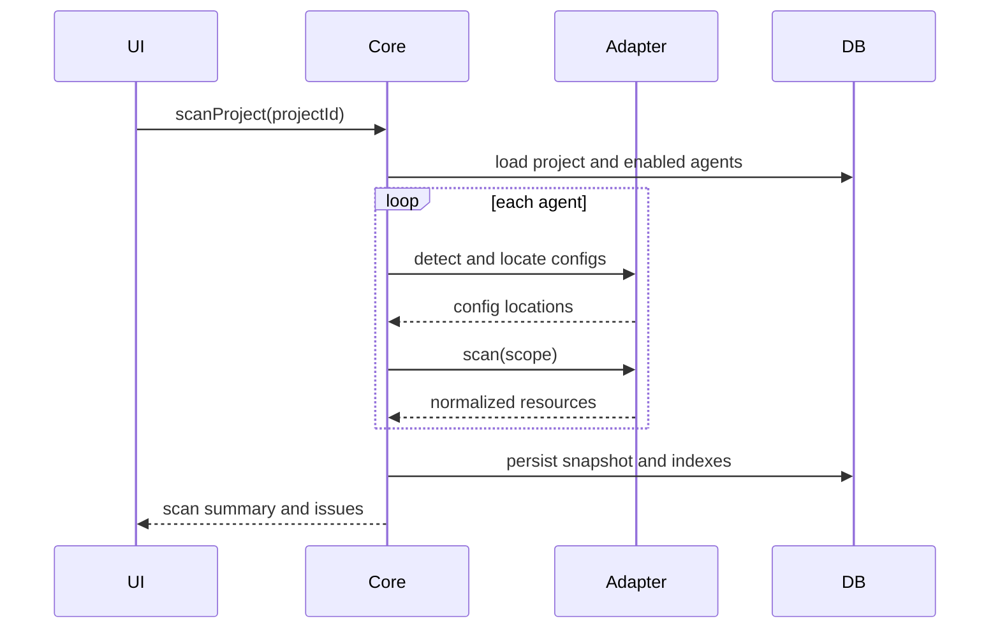
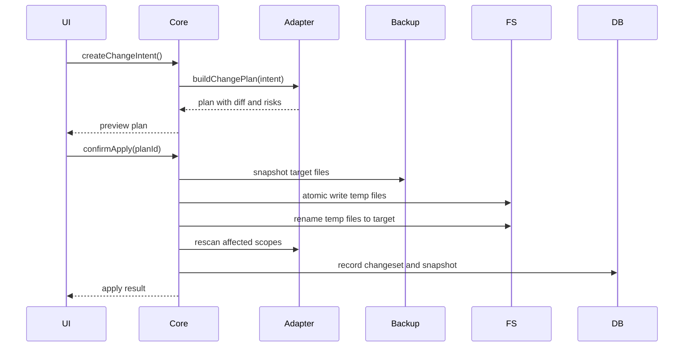

# AgentHub Local 技术实现方案

## Context

AgentHub Local 是一个面向程序员的 macOS 本地桌面应用，目标是统一管理 Claude Code、Codex、opencode、Pi coding agent 的 MCP、Skills、Sub-agents、Pi Resources 和 Prompt 模板。

产品的核心复杂度不在 UI，而在于本地配置读取、不同 agent 配置格式适配、配置变更前的影响预览、写入前备份、写入后校验和可回滚能力。

## Goals

- 提供 macOS Desktop App。
- 支持本地项目添加、扫描和 Project Matrix 展示。
- 支持 Claude Code、Codex、opencode、Pi coding agent 的检测和配置扫描。
- 支持 MCP、Skills、Sub-agents、Pi Resources、Prompts 的统一管理视图。
- 所有配置写入必须经过 `scan -> plan -> diff -> backup -> apply -> rescan -> record` 流程。
- 使用本地数据库保存索引、扫描快照、变更记录、备份记录和用户偏好。
- 不保存明文 API Key，不主动执行 MCP server 或 Pi extension。

## Non-Goals

- 不做云同步。
- 不做团队协作。
- 不做 Agent Chat UI。
- 不托管 MCP server。
- 不自动运行 MCP、extensions 或用户项目代码。
- 不在 MVP 做复杂多 agent workflow 编排。
- 不把通用 Prompt 自动写入项目规则文件。

## Constraints

- 应用需要读写本机配置文件，因此必须有清晰的路径授权、写入预览和回滚策略。
- 不同 agent 的配置格式和目录约定可能持续变化，必须通过 Adapter 隔离。
- Pi Resources 不能强行套入 MCP / Sub-agent 模型，需要独立资源模型。
- MVP 优先解决 Project Matrix、MCP Manager、Sub-agent Manager、Pi Resource Viewer、Prompt Copy Library、Doctor、Backup。
- 具体 agent 配置路径和格式需要在开发前用真实样本补一轮 fixture 调研。

## Recommended Stack

| Layer          | Choice                                           | Reason                                                   |
| -------------- | ------------------------------------------------ | -------------------------------------------------------- |
| Desktop Shell  | Tauri 2                                          | macOS 桌面体验好，权限模型清晰，适合本地文件管理类工具。 |
| Frontend       | React + TypeScript + Vite                        | 快速构建复杂管理界面，适合 Matrix、Diff、表单和搜索。    |
| UI             | Tailwind CSS + shadcn/ui 风格组件                | 构建密集型开发者工具界面，减少自定义基础组件成本。       |
| Backend Core   | Rust                                             | 适合本地文件系统、解析、diff、备份、原子写入和安全边界。 |
| Local DB       | SQLite                                           | 单机本地索引、扫描快照和变更记录足够。                   |
| Config Parsers | serde_json / toml / serde_yaml / markdown parser | 避免用字符串拼接处理配置。                               |
| Search         | SQLite FTS5 + 内存索引                           | Prompts、Skills、Projects、Resources 搜索。              |
| Packaging      | Tauri bundle + later updater                     | MVP 先本地打包，后续再加签名更新。                       |

Tauri 官方文档说明，文件系统 API 需要限制访问 scope 并防止路径遍历；Shell 执行也需要在 capability 中显式配置命令。这个产品应把文件读写和少量检测命令放在 Rust command 层，前端不直接获得任意文件系统或 shell 权限。

## Architecture



### Layer Responsibilities

| Layer           | Responsibility                                           |
| --------------- | -------------------------------------------------------- |
| React UI        | 路由、列表、详情、Matrix、Diff Preview、表单、状态展示。 |
| Tauri Commands  | 前端可调用 API，做参数校验、权限检查和错误转换。         |
| Domain Services | 扫描、索引、变更计划、Doctor、备份、回滚、搜索。         |
| Agent Adapters  | 处理每个 agent 的检测、解析、配置定位、计划生成和写入。  |
| SQLite          | 保存稳定索引和历史记录，不作为配置真实来源。             |
| File System     | agent 原始配置和 AgentHub Library 文件。                 |
| Backup Store    | 保存写入前快照、diff metadata 和恢复入口。               |

## Local Data Layout

建议使用 Tauri app data 目录作为应用私有数据根：

```text
AgentHubLocal/
  agenthub.db
  library/
    skills/
    sub-agents/
    prompts/
    mcp-templates/
  backups/
    2026-05-13T10-30-00Z/
      manifest.json
      files/
  logs/
  cache/
    scans/
```

约定：

- `agenthub.db` 只保存索引、快照、状态和历史。
- `library/` 是 AgentHub 自己管理的资源源头。
- agent 原始配置仍保留在原位置。
- `backups/` 保存写入前完整文件快照，不保存明文 secret 的额外副本之外的派生数据。
- `cache/` 可删除，不能作为唯一真实来源。

## Core Domain Model

| Entity            | Purpose                     | Key Fields                                                                   |
| ----------------- | --------------------------- | ---------------------------------------------------------------------------- |
| `Agent`           | 一个 Coding Agent 工具      | `id`, `kind`, `name`, `version`, `installed`, `capabilities`                 |
| `Project`         | 用户添加的项目目录          | `id`, `name`, `path`, `lastScannedAt`, `healthStatus`                        |
| `ConfigScope`     | 配置作用域                  | `agentId`, `scopeType`, `projectId`, `configPath`, `writable`                |
| `McpServer`       | MCP server 规范化模型       | `id`, `name`, `transport`, `command`, `args`, `envRefs`, `enabled`           |
| `Skill`           | AgentHub Skill Library 条目 | `id`, `slug`, `title`, `description`, `tags`, `status`, `sourcePath`         |
| `SubAgent`        | Claude/Codex 专家 agent     | `id`, `slug`, `role`, `agentKinds`, `boundMcpIds`, `boundSkillIds`           |
| `PiResource`      | Pi 原生资源                 | `id`, `resourceType`, `source`, `path`, `enabled`, `trusted`                 |
| `PromptTemplate`  | 通用 Prompt 模板            | `id`, `slug`, `title`, `body`, `variables`, `tags`                           |
| `ResourceBinding` | 资源启用关系                | `resourceType`, `resourceId`, `agentId`, `projectId`, `scopeType`, `enabled` |
| `ScanSnapshot`    | 一次扫描结果                | `id`, `projectId`, `agentId`, `summary`, `createdAt`                         |
| `DoctorIssue`     | 风险或健康检查结果          | `id`, `severity`, `category`, `message`, `targetRef`, `fixable`              |
| `ChangeSet`       | 一次计划或实际变更          | `id`, `status`, `operations`, `diffSummary`, `backupId`                      |
| `Backup`          | 写入前备份                  | `id`, `changeSetId`, `manifestPath`, `createdAt`                             |

## Agent Adapter Contract

每个 agent 通过统一接口接入，Domain 不直接理解某个 agent 的配置格式。

```ts
type AgentKind = 'claude-code' | 'codex' | 'opencode' | 'pi';
type ScopeType = 'global' | 'project';

interface AgentAdapter {
  kind: AgentKind;
  detectInstallation(): Promise<AgentDetection>;
  locateGlobalConfig(): Promise<ConfigLocation[]>;
  locateProjectConfig(projectPath: string): Promise<ConfigLocation[]>;
  scan(scope: ConfigScope): Promise<AgentScanResult>;
  buildChangePlan(input: ChangeIntent): Promise<ChangePlan>;
  validateAppliedChange(plan: ChangePlan): Promise<ValidationResult>;
  runDoctor(scope: ConfigScope): Promise<DoctorIssue[]>;
}
```

Adapter 规则：

- 只能读取自己声明支持的路径。
- 不直接写文件，必须返回 `ChangePlan`。
- `ChangePlan` 必须包含目标文件、结构化 patch、文本 diff、风险说明。
- 写入由 Domain 的 `ChangeService` 统一执行。
- 每个 Adapter 必须配套 fixture 测试，覆盖空配置、已有配置、重复配置、非法配置、项目覆盖全局配置。

## Supported Adapters

### Claude Code Adapter

MVP 能力：

- 检测安装状态和版本。
- 扫描全局 / 项目级 MCP。
- 扫描 Skills。
- 扫描 Sub-agents。
- 生成 MCP 启用 / 禁用 / 新增 / 删除计划。
- 生成 Sub-agent 同步计划。

待调研：

- 当前版本下全局配置路径、项目配置路径、Sub-agent 文件结构和 Skills 目录约定。

### Codex Adapter

MVP 能力：

- 检测安装状态和版本。
- 扫描 MCP、Skills、Custom Agents。
- 支持从 AgentHub Library 同步 Skills。
- 支持启用 / 禁用 Custom Agent 到全局或项目。

待调研：

- 当前 Codex 桌面 / CLI 的配置路径、Skills 目录、Custom Agents 定义格式和项目级覆盖规则。

### opencode Adapter

MVP 能力：

- 扫描配置文件中的 MCP servers。
- 识别 `enabled` 状态。
- 支持 MCP 增删改和项目级启用。
- 暂时只把 Skills 作为可选适配能力，不作为 P0 写入重点。

待调研：

- opencode 配置文件路径、JSON/TOML 格式、项目覆盖优先级。

### Pi Adapter

MVP 能力：

- 检测 Pi 安装和版本。
- 扫描 Settings。
- 扫描 Skills、Prompt Templates、Extensions、Packages、Themes。
- 支持把 AgentHub Skill Library 作为 Pi resource path 引用。
- 对 extension 和 package 给出风险提示。

限制：

- Pi 不进入 Sub-agent Manager。
- 不执行 extension。
- 不安装 package，只管理本地已存在资源和 settings 引用。

## Core Flows

### Scan Flow



扫描原则：

- 文件系统是真实来源。
- SQLite 是索引和快照。
- 扫描失败不阻断其他 agent。
- 每次扫描保留 summary，便于 Dashboard 和 Project Matrix 展示。

### Change Flow



写入原则：

- 没有用户确认不写入。
- 写入前必须备份所有受影响文件。
- 写入必须使用临时文件和原子 rename。
- 写入后必须 rescan 受影响 scope。
- 如果 rescan 失败，标记为 `applied_with_warning`，并提供恢复入口。

## Feature Design

### Dashboard

展示：

- 已检测 agent。
- 每个 agent 的安装状态、配置状态、资源数量。
- 最近项目。
- 最近配置变更。
- Doctor 风险摘要。

数据来源：

- `Agent`
- 最新 `ScanSnapshot`
- 未解决 `DoctorIssue`
- 最近 `ChangeSet`

### Projects

核心页面：

- Project List
- Project Detail
- MCP Matrix
- Skills Matrix
- Sub-agent Matrix
- Pi Resource Summary

Project Detail 以项目为中心聚合各 agent 的资源启用状态。Matrix 不直接读文件，读取最新扫描快照；用户点击重新扫描后刷新。

### MCP Manager

能力：

- 标准化展示不同 agent 的 MCP。
- 新增 / 编辑 / 删除 / 启用 / 禁用。
- 应用到全局或项目。
- 查看使用位置。
- 检测重复 MCP、缺失 env、明文 secret、危险 command。

MCP 规范化字段：

```text
name
description
transport
command
args
url
envRefs
enabled
agentBindings
projectBindings
tags
```

安全策略：

- env 只保存变量名引用，不保存变量值。
- 如果导入配置中发现疑似 secret，只做本地风险提示，不写入数据库的派生字段。
- command 风险规则先用静态规则，例如 shell、curl pipe shell、rm、chmod、sudo、osascript。

### Skills Library

MVP 做统一管理和启用，编辑器能力放到 P1。

能力：

- 创建基础 Skill metadata。
- 导入已有 Skill。
- 分类、标签、搜索。
- 启用到 Claude Code / Codex / Pi。
- 查看被哪些项目使用。
- 检查缺少说明、缺少入口文件、路径失效。

同步策略：

- Claude Code / Codex：默认复制或生成到目标 agent 目录，并记录 `ResourceBinding`。
- Pi：优先通过 resource path 引用 AgentHub Library，避免多份复制。
- opencode：P0 只展示和预留适配，不强制写入。

### Sub-agent Manager

适用：

- Claude Code
- Codex

不适用：

- opencode
- Pi

能力：

- 创建 / 编辑 / 删除 / 归档。
- 从模板创建。
- 绑定 MCP 和 Skills。
- 启用到全局或项目。
- 检测同名冲突、绑定资源不存在、权限过大。

内部模型与目标 agent 文件格式分离。AgentHub 保存 canonical model，Adapter 负责渲染成目标 agent 可识别的文件。

### Pi Resources

页面：

- Pi Overview
- Pi Settings
- Pi Skills
- Pi Prompt Templates
- Pi Extensions
- Pi Packages

能力：

- 读取 settings 和 resource paths。
- 展示 Skills / Prompts / Extensions / Packages 来源。
- 将 AgentHub Skill Library 引用给 Pi。
- 检查路径失效、package 重复、extension 风险、project settings 覆盖 global settings。

风险策略：

- Extension 默认标记为需要信任判断。
- Package 展示包含的 resources，不自动启用其 extension。
- 所有 Pi settings 写入都走 Change Flow。

### Prompts

能力：

- 创建、编辑、分类、搜索、收藏。
- 变量填写。
- 最终 Prompt 预览。
- 复制到剪贴板。

实现：

- Prompt body 使用 Markdown 文本。
- 变量使用 `{{variableName}}`。
- 渲染时检查缺失变量。
- 不自动写入任何 agent 配置。

### Doctor

检查类型：

| Category  | Rules                                                                                |
| --------- | ------------------------------------------------------------------------------------ |
| Agent     | 未安装、配置不可读、配置不可写、scope 覆盖冲突。                                     |
| MCP       | 重复、缺失 env、疑似明文 secret、危险 command、禁用但被项目引用。                    |
| Skill     | 缺少说明、缺少入口文件、路径失效、未被任何项目使用。                                 |
| Sub-agent | 同名冲突、绑定 MCP 不存在、绑定 Skill 不存在、权限过大。                             |
| Pi        | resource path 不存在、package 重复、extension 未信任、project settings 覆盖 global。 |

Issue 级别：

- `info`
- `warning`
- `critical`

MVP 先提供只读检查和少量安全修复建议，不做一键修复复杂配置。

### Backups

备份内容：

- 写入前目标文件完整快照。
- `manifest.json`，记录原路径、hash、大小、changeSetId、创建时间。
- diff summary。

恢复能力：

- 恢复单个文件。
- 恢复一次 ChangeSet 涉及的所有文件。
- 恢复后自动 rescan。

不做：

- 跨设备备份同步。
- 备份加密。
- 长期归档清理策略的复杂配置。

## API Surface

Tauri command 设计：

```text
app.getDashboard()
agents.scanAll()
agents.getAgent(agentId)
projects.add(path)
projects.list()
projects.scan(projectId)
projects.getMatrix(projectId)
mcp.list(filters)
mcp.createChangePlan(intent)
subAgents.list(filters)
subAgents.createChangePlan(intent)
skills.list(filters)
skills.createChangePlan(intent)
pi.getOverview(projectId?)
pi.createChangePlan(intent)
prompts.list(filters)
prompts.render(promptId, variables)
doctor.run(target)
backups.list()
backups.restore(backupId, options)
changes.preview(intent)
changes.apply(changeSetId)
```

错误模型：

```text
code
message
target
recoverable
details
```

前端只展示可操作信息，详细错误写入本地日志。

## Database Schema Draft

MVP 表：

```text
agents
projects
config_scopes
resources
resource_bindings
scan_snapshots
doctor_issues
change_sets
backups
prompt_templates
settings
```

`resources` 使用统一表承载 MCP、Skill、Sub-agent、PiResource，再用 `resource_type` 区分；复杂字段放 `json_payload`。如果后续查询压力变大，再拆分专用表。

## Frontend Routes

```text
/
/projects
/projects/:projectId
/mcp
/mcp/:mcpId
/skills
/skills/:skillId
/sub-agents
/sub-agents/:subAgentId
/pi
/pi/settings
/pi/skills
/pi/prompts
/pi/extensions
/pi/packages
/prompts
/prompts/:promptId
/doctor
/backups
/settings
```

UI 原则：

- 默认展示密集、可扫描的工作台界面。
- Matrix 是核心，不做营销式首页。
- 所有写入动作都显示影响范围、目标文件、diff 和风险。
- 危险操作必须二次确认。
- 尽量使用表格、分段控件、搜索、过滤器、状态徽标和侧边详情面板。

## Security Model

### Path Access

- 项目路径必须由用户显式添加。
- 只允许访问用户添加的项目路径、已识别 agent 配置路径、AgentHub app data 目录。
- 对外部路径写入前必须显示完整路径。
- 禁止跟随可疑 symlink 写入，除非用户明确确认。

### Secrets

- 不保存 API Key 明文。
- env 只保存变量名。
- 导入时如发现疑似 secret，只在本次扫描结果中提示。
- 日志和数据库避免写入 secret 原文。

### Command Execution

- 默认不执行 MCP server、Pi extension 或 package。
- 检测版本时优先读取文件或使用受限命令。
- 如必须执行外部命令，只允许固定命令和固定参数 schema。

### Writes

- 所有写入必须由 ChangeService 统一执行。
- 写入前备份。
- 写入后 hash 校验。
- 写入后 rescan。
- 失败时保留 backup 和失败状态。

## Testing Strategy

### Unit Tests

- parser tests：JSON/TOML/YAML/Markdown。
- adapter tests：每个 agent 的 scan 和 buildChangePlan。
- doctor rules tests。
- secret detector tests。
- prompt variable renderer tests。

### Integration Tests

- 使用 fixture 项目目录模拟全局和项目级配置。
- 验证 scan -> plan -> apply -> rescan。
- 验证备份和恢复。
- 验证 Matrix 聚合结果。

### UI Tests

- Dashboard 渲染。
- Project Matrix 过滤和状态展示。
- Change Preview diff 展示。
- Backup restore flow。
- Prompt render flow。

### Manual QA

- 在真实 macOS 环境安装 Claude Code / Codex / opencode / Pi 后跑全量扫描。
- 对真实项目执行只读扫描。
- 对临时 fixture 项目执行写入和恢复。

## Rollout Plan

### Milestone 0: Discovery Fixtures

- 收集四个 agent 的真实配置样本。
- 确认全局配置路径、项目配置路径、资源目录结构。
- 建立 `fixtures/agents/` 测试样本。
- 输出 Adapter path matrix。

### Milestone 1: App Skeleton

- Tauri + React + SQLite 初始化。
- 基础路由和布局。
- 本地数据库 migration。
- 项目添加和本地设置。

### Milestone 2: Read-only Scan

- Agent 检测。
- Project scan。
- Dashboard。
- Project Matrix read-only。
- Doctor read-only。

### Milestone 3: MCP Write Path

- MCP ChangePlan。
- Diff Preview。
- Backup。
- Apply。
- Restore。
- MCP Matrix 更新。

### Milestone 4: Sub-agent + Skills

- AgentHub Library。
- Sub-agent canonical model。
- Claude / Codex 同步。
- Skill 引用和同步。

### Milestone 5: Pi Resources + Prompts

- Pi Overview 和 resource path 管理。
- Pi Skills 引用 AgentHub Library。
- Prompt 模板创建、变量渲染和复制。

### Milestone 6: MVP Hardening

- 完整 Doctor。
- 错误处理和日志。
- 性能优化。
- macOS 打包。
- 文档和手动 QA 清单。

## Alternatives

| Option                  | Pros                                      | Cons                                           | Decision                       |
| ----------------------- | ----------------------------------------- | ---------------------------------------------- | ------------------------------ |
| Tauri + React + Rust    | 轻量、安全边界清晰、本地文件能力强。      | Rust 开发成本高，配置解析需要更多类型建模。    | 推荐。                         |
| Electron + React + Node | 本地文件和配置处理开发最快，JS 生态成熟。 | 包体大，Node 权限面更大，需要更严格隔离。      | 备选，若 Rust 成本过高可切换。 |
| SwiftUI Native          | macOS 原生体验最好。                      | UI 迭代和跨格式解析生态不如 TS/Rust 组合灵活。 | 不推荐 MVP。                   |
| Web App + Local Agent   | UI 部署简单。                             | 需要额外本地 daemon，权限和安装流程更复杂。    | 不推荐 MVP。                   |

## Risks

| Risk                    | Impact                 | Mitigation                                         |
| ----------------------- | ---------------------- | -------------------------------------------------- |
| agent 配置格式变化      | 写入失败或配置损坏。   | Adapter fixture、版本检测、保守写入、写后 rescan。 |
| 误写用户配置            | 影响真实开发环境。     | Change Preview、备份、原子写入、恢复入口。         |
| secret 泄露到 DB 或日志 | 严重安全问题。         | secret redaction、只存 env var name、日志过滤。    |
| Pi extension 风险误判   | 用户误启用危险扩展。   | 默认只读展示，不执行，风险标记。                   |
| Matrix 聚合不准确       | 用户误解项目状态。     | 扫描快照保留来源路径和 scope，展示来源详情。       |
| 权限过宽                | 桌面应用安全边界变弱。 | Tauri capability 限制、Rust command 白名单。       |

## Validation Plan

- 每个 Adapter 至少 10 个 fixture case。
- 每个写入操作必须有 apply + restore 集成测试。
- Doctor 检查规则覆盖 PRD 中 P0 风险。
- 使用临时项目目录完成端到端手动测试。
- 对真实配置先只读扫描，不直接写入。
- 打包前执行一次完整备份恢复演练。

## Open Questions

- Claude Code 当前版本的 Skills 和 Sub-agent 文件结构是否稳定。
- Codex Custom Agents 和 Skills 的项目级配置路径是否有明确优先级。
- opencode Skills 是否进入 MVP 写入范围，还是只展示 MCP。
- Pi settings 对 resource path 的合并和覆盖规则是否需要 UI 明确展示。
- AgentHub Library 对 Claude / Codex 采用复制、symlink 还是生成文件引用。
- 是否需要对备份文件做本地加密。

## References

- [Tauri File System plugin](https://v2.tauri.app/reference/javascript/fs/)
- [Tauri Shell plugin](https://v2.tauri.app/reference/javascript/shell/)
- [Tauri SQL plugin](https://v2.tauri.app/zh-cn/plugin/sql/)
- [Tauri Updater plugin](https://v2.tauri.app/plugin/updater/)
